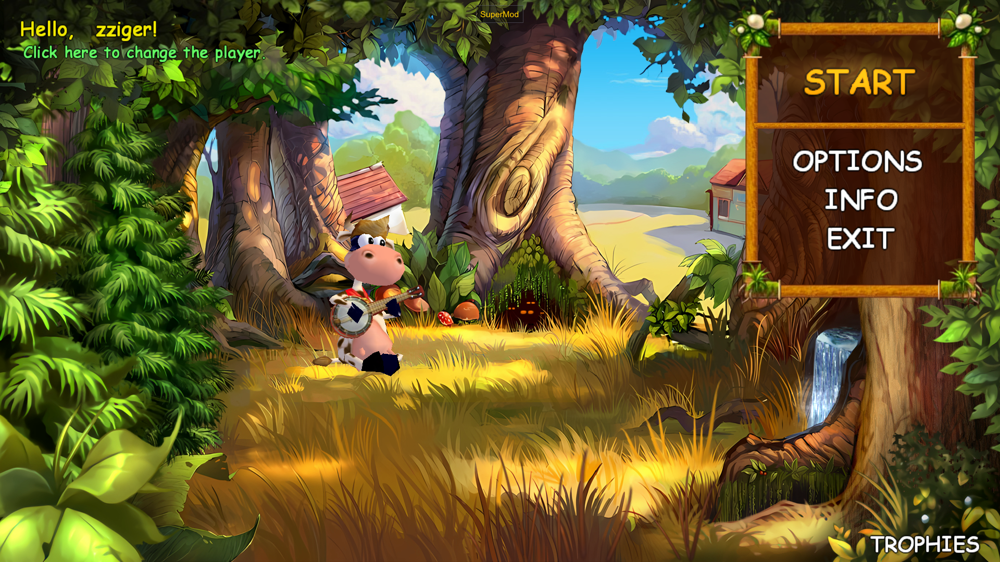

# SuperCow Widescreen fix

| [**Download / Скачать**](https://github.com/zziger/supercow-widescreen-fix/archive/refs/heads/master.zip) | [**Discord сервер**](https://discord.gg/VerZycPqhS) |
|-------------------------------------------------------------------------------------------------------|-----------------------------------------------------|

Мод, адаптирующий игру "Супер Корова" (Nevosoft) к 16:9 экранам  

## Установка 

1. Установить [**SuperMod**](https://github.com/zziger/supercow-mod#readme)
2. Скачать последнюю версию мода [**тут**](https://github.com/zziger/supercow-widescreen-fix/archive/refs/heads/master.zip)
3. Запустить игру
4. Перетянуть архив с модом на окно игры или распаковать архив в папку `mods`

> ⚠️ Минимальная версия SuperMod: **2.2.0**

## Авторы

- [zziger](https://github.com/zziger) - Патчи интерфейсов
- [Creepobot](https://github.com/creepobot) - Патчи внутриигрового интерфейса и камеры
- Dvuediniy - графика и ассеты

## Лицензия

[MIT](LICENSE)
